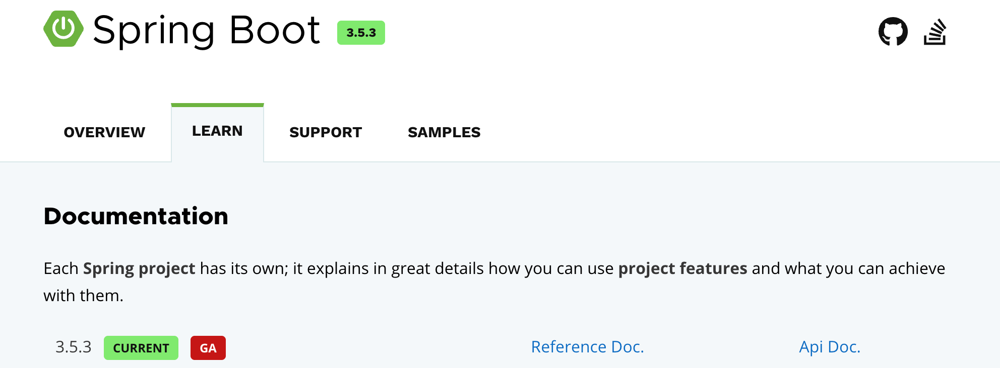
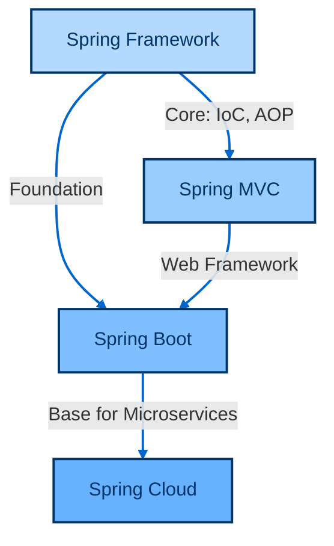

# 01-SpringBoot-Introduce

> 官方文档：[https://spring.io/projects/spring-boot](https://spring.io/projects/spring-boot)

## 背景与诞生

Spring 框架是 Java 后端开发的基石，以其核心特性 **IoC（控制反转）** 和 **AOP（面向切面编程）** 著称。IoC 有效管理对象依赖，降低耦合；AOP 通过动态代理实现事务、缓存、日志等功能。然而，传统 Spring 框架依赖复杂的 XML 或 Java 配置，开发者需深入了解组件细节，配置繁琐，增加了学习和使用成本。

为解决这一问题，Spring Boot 于 2014 年由 Pivotal 团队推出，旨在简化 Spring 开发，提供开箱即用的体验，使开发者能快速构建基于 Spring 生态的应用。

## 什么是 Spring Boot？

Spring Boot 是 Spring 生态中的子项目，致力于提供一站式解决方案，通过简化配置和集成，降低 Spring 框架的使用门槛。它已成为 Java 后端开发的标配框架，具备以下核心特点：

* **自动配置：** 根据类路径和少量配置，自动完成组件初始化，减少手动配置。
* **Starters：** 提供一站式依赖管理，引入如 `spring-boot-starter-web` 即可快速集成 Web 开发功能。
* **独立运行：** 内置 Servlet 容器（如 Tomcat、Jetty），支持以 `java -jar` 运行独立的可执行 JAR 包。
* **无 XML 配置：** 摒弃繁琐的 XML，依赖条件注解完成配置。
* **生产级特性：** 提供健康检查、指标监控、端点等功能，优化生产环境部署。

Spring Boot 3.0 进一步支持 GraalVM 原生镜像，提升启动速度和运行效率。

## 核心思想：约定优于配置

pring Boot 的设计理念是 **约定优于配置（Convention over Configuration）**，通过以下方式减少开发者的配置工作：

1. **默认配置**：提供推荐的默认参数，适用于大多数场景。
2. **按需定制**：开发者只需定义偏离默认值的配置，极大简化开发流程。

例如，Spring Boot 默认提供配置文件格式（如 `application.yml`）和默认值，开发者只需补充特定需求即可。这种设计在自动配置、Starters 等功能中广泛体现。

## Spring 生态中的组件关系

Spring Boot 依赖 Spring 框架，并对其进行封装和简化：

* **Spring 框架**：提供核心功能（如 IoC、AOP），是 Spring Boot 和 Spring MVC 的基础。
* **Spring MVC**：基于 Spring 的 Web 框架，处理 HTTP 请求，依赖 spring-core 和 spring-beans。
* **Spring Boot**：通过 Starters（如 spring-boot-starter-web）集成 Spring MVC 和其他组件，提供自动配置和简化开发体验。
* **Spring Cloud**：基于 Spring Boot 构建，专注于微服务架构，依赖 Spring Boot 和 Spring 框架。

这些框架层层依赖，Spring Boot 并不取代 Spring 或 Spring MVC，而是优化其使用方式。

## 核心特性

1. **独立运行：** Spring Boot 内置 Servlet 容器（如 Tomcat、Jetty、Undertow），无需外部容器即可通过 `java -jar` 运行可执行 JAR 包，简化部署流程。
2. **简化配置：** 通过 Starters（如 `spring-boot-starter-web`），开发者只需引入依赖即可获得默认配置，快速启用相关功能。
3. **自动配置：** Spring Boot 根据类路径中的依赖自动推断并配置所需组件。例如，检测到 HikariCP 依赖时，会自动配置连接池；若开发者自定义配置，则优先使用自定义设置。
4. **无代码生成与XML：** Spring Boot 通过条件注解（如 `@EnableAutoConfiguration`）实现配置，避免代码生成和 XML 文件，简化开发。
5. **生产级特性：** 提供端点、健康检查、指标监控等功能，便于生产环境中的应用管理与监控。

## 核心模块

Spring Boot 由多个子模块组成，覆盖开发、测试、部署等场景：

1. **spring-boot**：核心模块，提供启动类和容器初始化，支持内置 Servlet 容器和配置外部化。
2. **spring-boot-autoconfigure**：实现自动配置，通过 `@EnableAutoConfiguration` 注解根据环境动态配置组件。
3. **spring-boot-starters**：提供一站式依赖管理，简化技术集成。
4. **spring-boot-actuator**：提供监控功能，如健康检查和端点管理。
5. **spring-boot-test**：支持单元测试，包含核心测试组件和注解。
6. **spring-boot-devtools**：提升开发效率，支持代码修改后自动重启（仅限开发环境）。
7. **spring-boot-loader**：支持构建可执行 JAR 包。
8. **spring-boot-cli**：提供命令行工具，支持 Groovy 脚本快速开发。

## 总结

Spring Boot 通过自动配置、Starters 和约定优于配置的理念，极大简化了 Spring 框架的使用，使开发者能快速构建健壮的 Java 应用。它不仅支持传统 WAR 包部署，还能生成独立运行的 JAR 包，结合生产级特性，成为现代 Java 后端开发的首选框架。

