# 02-Spring Boot-环境说明

## 版本选择与生命周期

Spring Boot 维护多个版本线，每个版本的生命周期和用途不同。根据 Spring Boot 官方文档，截至 2025 年 7 月，最新版本为 ==3.5.3 GA==，目前维护的版本包括：

* 3.5.3 (CURRENT GA): 最新正式版本，适合学习和测试，生产环境需谨慎使用。
* 3.4.7 GA: 稳定版本，推荐用于生产环境。
* 3.3.13 GA, 3.2.12 GA, 3.1.12 GA, 3.0.13 GA, 2.7.18 GA: 较旧的稳定版本，部分仍在商业支持范围内。
* 4.0.0-SNAPSHOT, 3.5.4-SNAPSHOT, 3.4.8-SNAPSHOT: 快照版本，仅限开发测试。
* 2.7.27.1 GA: 特定补丁版本，仍在支持范围内。

具体[版本](https://spring.io/projects/spring-boot#learn)如下所示：


各版本[生命周期](https://spring.io/projects/spring-boot#support)如下：


### 版本类型说明

1. **GA (General Availability)**：正式版本，稳定且不更改内容，适用于生产环境。版本号如 3.5.3 或早期版本如 2.3.12.RELEASE（2.4.x 前使用 .RELEASE 后缀）。（==推荐：生产项目必须使用 GA 版本，从 Maven 中央仓库获取。==）
2. **CURRENT**：最新的 GA 版本（如 3.5.3），适合学习和研究。由于用户量较少，可能存在潜在问题，生产环境建议选用比 CURRENT 低几个版本的 GA 版本（如 3.4.7）以确保稳定性。
3. **SNAPSHOT**：快照版本（如 4.0.0-SNAPSHOT），每日构建，包含最新变更，适合开发测试，不建议用于生产，因可能包含较多 bug。需配置 Spring 快照仓库。
4. **PRE (Pre-release)**：预览版本，分为：
    * **里程碑版本**（如 3.5.3-M1）：早期测试版本，功能开发中。
    * **候选版本**（如 3.5.3-RC1）：接近正式发布，稳定性较高。

> TIP: 预览版本仅用于测试和学习新特性，需配置 Spring 里程碑仓库，**不建议**用于生产。

### 版本发布流程

Spring Boot 版本从 SNAPSHOT 开始，逐步迭代至 PRE（里程碑 M1、M2...，候选 RC1、RC2...），最终发布 GA 版本。发布 GA 后，SNAPSHOT 和 PRE 版本停止维护，下一版本重新从 SNAPSHOT 开始。例如，3.5.3 的发布路径为：

```mermaid
graph LR
    A[3.5.3-SNAPSHOT] -->|Iterate| B[3.5.3-M1]
    B -->|Iterate| C[3.5.3-M2]
    C -->|Iterate| D[3.5.3-M3]
    D -->|Iterate| E[3.5.3-RC1]
    E -->|Release| F[3.5.3 GA]

    classDef default fill:#e6f3ff,stroke:#0066cc,stroke-width:2px,color:#003366;
    classDef snapshot fill:#ffcccc,stroke:#cc0000,stroke-width:2px,color:#003366;
    classDef milestone fill:#ffe6cc,stroke:#e68a00,stroke-width:2px,color:#003366;
    classDef candidate fill:#ccffcc,stroke:#009900,stroke-width:2px,color:#003366;
    classDef ga fill:#b3d9ff,stroke:#003366,stroke-width:2px,color:#003366;

    class A snapshot;
    class B,C,D milestone;
    class E candidate;
    class F ga;

    linkStyle default stroke:#0066cc,stroke-width:2px;
```



### Maven 仓库配置

SNAPSHOT 和 PRE 版本未发布到 Maven 中央仓库，需添加 Spring 仓库：

```xml
<repositories>
    <repository>
        <id>spring-snapshots</id>
        <url>https://repo.spring.io/snapshot</url>
        <snapshots><enabled>true</enabled></snapshots>
    </repository>
    <repository>
        <id>spring-milestones</id>
        <url>https://repo.spring.io/milestone</url>
    </repository>
</repositories>

<pluginRepositories>
    <pluginRepository>
        <id>spring-snapshots</id>
        <url>https://repo.spring.io/snapshot</url>
    </pluginRepository>
    <pluginRepository>
        <id>spring-milestones</id>
        <url>https://repo.spring.io/milestone</url>
    </pluginRepository>
</pluginRepositories>
```

### 版本选择建议

* **学习/测试**：使用 CURRENT（如 3.5.3）或 SNAPSHOT/PRE 版本，体验最新功能。
* **生产环境**：
    * 优先选择稳定 GA 版本（如 3.4.7），避免 CURRENT 版本的潜在风险。
    * 避免使用已停止维护的版本（如 3.4.x 及以下将于 2025 年底停止维护）。
    * 内部系统若无外网暴露，可灵活选择无重大 bug 的 GA 版本。
* **商业支持**：2.7.x 及以上版本仍受商业支持，4.0.0 发布后仅 3.4.x 及以上版本免费支持。

## 环境要求

Spring Boot 不同版本对 Java、Spring 框架、构建工具及 Servlet 容器的要求不同。以下基于最新版本（3.5.3）及主要版本线的环境要求对比。

具体每个版本的环境要求，可以在官方文档对应版本 [Reference Doc.](https://docs.spring.io/spring-boot/3.4/index.html) 的 [System Requirements](https://docs.spring.io/spring-boot/3.4/system-requirements.html) 中找到，例如：


### Java 开发环境要求

| Spring Boot | JDK | Spring Framework | Maven | Gradle |
| -- | -- | -- | -- | -- |
| 3.5.3 | 17 ~ 24 | 6.2.7+ | 3.6.3+ | 7.6.4+, 8.4+ |
| 3.4.7 | 17 ~ 23 | 6.2.0+ | 3.6.3+ | 7.6.4+, 8.4+ |
| 3.3.13 | 17 ~ 22 | 6.1.8+ | 3.6.3+ | 7.5+, 8.x |
| 3.2.12 | 17 ~ 21 | 6.1.1+ | 3.6.3+ | 7.5+, 8.x |
| 3.1.12 | 17 ~ 20 | 6.0.9+ | 3.6.3+ | 7.5+, 8.x |
| 3.0.13 | 17 ~ 19 | 6.0.2+ | 3.5+ | 7.5+ |
| 2.7.18 | 8 ~ 20 | 5.3.27+ | 3.5+ | 6.8.x, 6.9.x, 7.x, 8.x |

**说明:**

* Spring Boot 3.5.3 要求 JDK 17 至 24，推荐使用 OpenJDK 或其他开源 JDK，以规避 Oracle JDK 可能的收费风险。
* Spring Framework 版本需与 Spring Boot 匹配，例如 3.5.3 需 Spring 6.2.7+。
* Maven 和 Gradle 版本需满足最低要求，确保构建兼容性。

### Servlet 容器要求

| Spring Boot | Servlet | Tomcat | Jetty | Undertow |
| -- | -- | -- | -- | -- |
| 3.5.3 | 5.0+ | 10.1.25+ | 12.0 | 2.3 |
| 3.4.7 | 5.0+ | 10.1.25+ | 12.0 | 2.3 |
| 3.3.13 | 5.0+ | 10.1 | 12.0 | 2.3 |
| 3.2.12 | 5.0+ | 10.1 | 12.0 | 2.3 |
| 3.1.12 | 5.0+ | 10 | 11 | 2.2 |
| 3.0.13 | 5.0+ | 10 | 11 | 2.2 |
| 2.7.18 | 3.1+ | 9.0 | 9.4/10.0 | 2.0 |

**说明：**

* Spring Boot 3.0+ 要求 Servlet 5.0+，已从 Java EE 迁移至 Jakarta EE（最低 Jakarta EE 9，兼容 Jakarta EE 10），包名变更需注意兼容性。
* 内置容器（如 Tomcat、Jetty、Undertow）版本需匹配，确保运行时稳定性。

## 总结

Spring Boot 提供清晰的版本管理和环境要求，开发者需根据项目需求选择合适的版本：

* **学习/测试**：使用 3.5.3 或 SNAPSHOT/PRE 版本，需配置 Spring 仓库。
* **生产环境**：推荐 3.4.7 等稳定 GA 版本，避免已停止维护的版本。
* **环境配置**：确保 JDK、Spring Framework、Maven/Gradle 及 Servlet 容器版本匹配，特别是 3.5.3 需 JDK 17+ 和 Jakarta EE 兼容性。

通过合理选择版本和配置环境，开发者可充分利用 Spring Boot 的简化和自动化特性，快速构建高效的 Java 应用。
