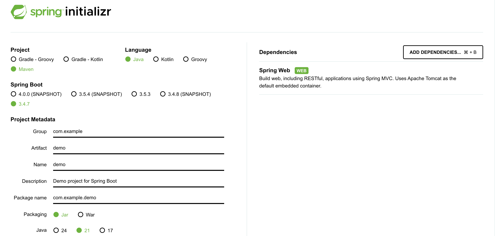

# 03-SpringBoot-QuickStart

Spring Boot 的设计目标是简化开发流程，通过便捷的集成方式和自动化配置，让开发者快速构建生产级应用。本文将深入探讨 Spring Boot 的集成方式，并通过一个简单的 Hello World 接口示例，展示如何快速上手 Spring Boot 开发。

Spring Boot 提供了两种主要集成方式，满足不同开发场景：

1. **Maven/Gradle 插件:** Maven 是 Java 开发中最主流的构建工具，广泛用于项目管理。本文以 Maven 为例，介绍 Spring Boot 的集成方式。Gradle 类似，但配置稍有不同，适用于偏好声明式构建的开发者。
2. **Spring Boot CLI:** 命令行工具，适合快速原型开发，支持 Groovy 脚本编写，简化依赖管理和运行。本文聚焦 Maven 集成，因其在企业开发中更为普遍。

## 使用 Maven 集成 Spring Boot

Spring Boot 提供两种 Maven 集成方式：继承 `spring-boot-starter-parent` 和 导入 `spring-boot-dependencies`。以下详细对比两种方式的实现、优缺点及适用场景。

### 1.继承 spring-boot-starter-parent

通过在 pom.xml 中继承 `spring-boot-starter-parent`，可以快速获取 Spring Boot 的默认配置和依赖管理：

```xml
<parent>
    <groupId>org.springframework.boot</groupId>
    <artifactId>spring-boot-starter-parent</artifactId>
    <version>3.4.7</version>
    <relativePath/>
</parent>
```

**实现原理**: `spring-boot-starter-parent` 继承了 `spring-boot-dependencies`，并预定义了常用的属性和插件配置，例如：

* **属性**：Java 版本（默认 17）、编码（UTF-8）、资源分隔符等。
* **插件**：`spring-boot-maven-plugin` 用于打包和运行可执行 JAR。

---

<center><strong>优点</strong></center>

**简化配置**：无需显式配置 `spring-boot-maven-plugin`，直接声明即可使用：

```xml
<build>
    <plugins>
        <plugin>
            <groupId>org.springframework.boot</groupId>
            <artifactId>spring-boot-maven-plugin</artifactId>
        </plugin>
    </plugins>
</build>
```

**版本覆盖**：可通过 `properties` 覆盖依赖版本，例如：

```xml
<properties>
    <slf4j.version>2.0.13</slf4j.version>
</properties>
```

**开箱即用**：提供默认的编译、打包和运行配置，适合快速开发。

---

<center><strong>缺点</strong></center>

**单继承限制**：Maven 只支持单继承。若项目需继承公司自定义父 POM，则无法同时继承 `spring-boot-starter-parent`，限制了扩展性。

### 2.导入 spring-boot-dependencies

通过在 `dependencyManagement` 中导入 `spring-boot-dependencies`，实现依赖版本管理：

```xml
<dependencyManagement>
    <dependencies>
        <dependency>
            <groupId>org.springframework.boot</groupId>
            <artifactId>spring-boot-dependencies</artifactId>
            <version>3.4.7</version>
            <type>pom</type>
            <scope>import</scope>
        </dependency>
    </dependencies>
</dependencyManagement>
```

**实现原理:** `spring-boot-dependencies` 定义了 Spring Boot 生态中所有依赖的版本，但不包含插件或属性配置。开发者需手动配置插件，如 `spring-boot-maven-plugin`，并显式声明依赖版本：

```xml
<dependencies>
    <dependency>
        <groupId>org.slf4j</groupId>
        <artifactId>slf4j-api</artifactId>
        <version>2.0.13</version>
    </dependency>
</dependencies>

<build>
    <plugins>
        <plugin>
            <groupId>org.springframework.boot</groupId>
            <artifactId>spring-boot-maven-plugin</artifactId>
            <version>3.4.7</version>
            <executions>
                <execution>
                    <goals>
                        <goal>repackage</goal>
                    </goals>
                </execution>
            </executions>
        </plugin>
    </plugins>
</build>
```

---

<center><strong>优点</strong></center>

* **灵活性高:** 无需继承父 POM，适合已有父项目的多模块工程。
* **模块化管理:** 仅导入依赖版本，项目结构更自由。

---

<center><strong>缺点</strong></center>

* **配置繁琐:** 需手动配置插件和依赖版本，增加初始设置工作量。
* **易出错:** 缺少默认属性，可能导致配置不一致。

> **选择建议:**
> * **优先继承 `spring-boot-starter-parent`**：适合单模块项目或快速原型开发，配置简单，适合初学者和标准 Spring Boot 应用。
> * **使用 `spring-boot-dependencies`**：适合多模块项目或需继承其他父 POM 的场景，确保灵活性和兼容性。
> * **项目实践**：根据项目复杂度选择。若无特殊需求，继承方式更高效；若需扩展或公司有自定义父 POM，导入方式更合适。

## 快速开发 Hello World 接口

以下通过一个简单的 Hello World 接口示例，展示 Spring Boot 的快速集成与开发流程，使用最新版本 ==3.4.7==。

### 1.生成项目

Spring 提供 [start.spring.io](start.spring.io) 在线工具，快速生成 Spring Boot 项目。配置示例：

* **构建工具:** Maven
* **语言:** Java
* **Spring Boot 版本:** 3.4.7
* **JDK:** 21
* **依赖:** spring-boot-starter-web（Web 开发支持）



点击 **GENERATE** 下载项目，导入 IDE（如 IntelliJ IDEA）。生成的项目结构如下：

```plain
├── pom.xml
└── src
    ├── main
    │   ├── java
    │   │   └── com
    │   │       └── example
    │   │           └── demo
    │   │               └── DemoApplication.java
    │   └── resources
    │       └── application.properties
    └── test
        └── java
            └── com
                └── example
                    └── demo
                        └── DemoApplicationTests.java
```

POM 文件内容：

```xml
<?xml version="1.0" encoding="UTF-8"?>
<project xmlns="http://maven.apache.org/POM/4.0.0" xmlns:xsi="http://www.w3.org/2001/XMLSchema-instance"
         xsi:schemaLocation="http://maven.apache.org/POM/4.0.0 https://maven.apache.org/xsd/maven-4.0.0.xsd">
    <modelVersion>4.0.0</modelVersion>

    <parent>
        <groupId>org.springframework.boot</groupId>
        <artifactId>spring-boot-starter-parent</artifactId>
        <version>3.4.7</version>
        <relativePath/>
    </parent>

    <groupId>com.example</groupId>
    <artifactId>demo</artifactId>
    <version>0.0.1-SNAPSHOT</version>

    <name>demo</name>
    <description>Demo project for Spring Boot</description>

    <properties>
        <java.version>21</java.version>
    </properties>

    <dependencies>
        <dependency>
            <groupId>org.springframework.boot</groupId>
            <artifactId>spring-boot-starter-web</artifactId>
        </dependency>

        <dependency>
            <groupId>org.springframework.boot</groupId>
            <artifactId>spring-boot-starter-test</artifactId>
            <scope>test</scope>
        </dependency>
    </dependencies>

    <build>
        <plugins>
            <plugin>
                <groupId>org.springframework.boot</groupId>
                <artifactId>spring-boot-maven-plugin</artifactId>
            </plugin>
        </plugins>
    </build>
</project>
```

**说明:**

* 继承 `spring-boot-starter-parent`，自动引入 `spring-boot-starter-web` 和 `spring-boot-starter-test`。
* `spring-boot-maven-plugin` 确保项目可打包为可执行 JAR。

### 2. 编写启动类与接口

修改 `DemoApplication.java`，添加一个 `/hello` 接口：

```java
package com.example.demo;

import org.springframework.boot.SpringApplication;
import org.springframework.boot.autoconfigure.SpringBootApplication;
import org.springframework.web.bind.annotation.RequestMapping;
import org.springframework.web.bind.annotation.RestController;

@RestController
@SpringBootApplication
public class DemoApplication {

    public static void main(String[] args) {
        SpringApplication.run(DemoApplication.class, args);
    }

    @RequestMapping("/hello")
    public String helloWorld() {
        return "Hello, World!";
    }
}
```

**说明:**

* `@SpringBootApplication`：标记 Spring Boot 入口类，启用自动配置和组件扫描。
* `@RestController`：结合 `@Controller` 和 `@ResponseBody`，返回 JSON 或文本。
* `@RequestMapping("/hello")`：定义 HTTP GET 接口 `/hello`，返回 "Hello, World!"。

### 3. 启动应用

两种启动方式：

1. 运行 Main 方法: 在 IDE 中直接运行 DemoApplication 的 main 方法。适合快速调试，但可能无法处理复杂的资源占位符。
2. 使用 Maven 插件: 执行命令

```bash
mvn spring-boot:run
```

推荐方式，利用 `spring-boot-maven-plugin` 确保资源文件和配置正确加载。

启动日志示例：

```plain
  .   ____          _            __ _ _
 /\\ / ___'_ __ _ _(_)_ __  __ _ \ \ \ \
( ( )\___ | '_ | '_| | '_ \/ _` | \ \ \ \
 \\/  ___)| |_)| | | | | || (_| |  ) ) ) )
  '  |____| .__|_| |_|_| |_\__, | / / / /
 =========|_|==============|___/=/_/_/_/
 :: Spring Boot ::        (v3.4.7)
...
INFO  [restartedMain] o.s.b.w.embedded.tomcat.TomcatWebServer  : Tomcat started on port 8080 (http) with context path '/'
INFO  [restartedMain] com.example.demo.DemoApplication         : Started DemoApplication in 0.7 seconds
```

默认端口为 8080，应用启动后可访问接口。

### 4. 测试接口

在浏览器或工具（如 Postman）访问：

```http
http://localhost:8080/hello
```

响应：

```plain
Hello, World!
```

## 最佳实践

**自动配置:** `spring-boot-starter-web` 自动配置了 Spring MVC、Tomcat 和相关依赖，开发者无需手动设置 `DispatcherServlet` 或 `Servlet` 容器。

**模块化设计:** 建议将控制器逻辑分离到独立的 `@RestController` 类中，保持启动类简洁，便于维护。

**生产环境:** 

使用 `spring-boot-maven-plugin` 打包可执行 JAR：
    
```bash
mvn package
java -jar target/demo-0.0.1-SNAPSHOT.jar
```

配置 `application.properties` 自定义端口或上下文路径，例如：

```properties
server.port=9090
server.servlet.context-path=/api
```

**调试与开发:** 引入 `spring-boot-devtools` 实现代码修改后自动重启，提升开发效率：

```xml
<dependency>
    <groupId>org.springframework.boot</groupId>
    <artifactId>spring-boot-devtools</artifactId>
    <scope>runtime</scope>
    <optional>true</optional>
</dependency>
```

## 总结

Spring Boot 通过 Maven 集成（继承或导入方式）和 Starters 简化了依赖管理与配置，结合 [start.spring.io](start.spring.io) 可快速生成项目框架。无论是继承 `spring-boot-starter-parent` 的便捷性，还是导入 `spring-boot-dependencies` 的灵活性，Spring Boot 都能满足不同项目需求。

